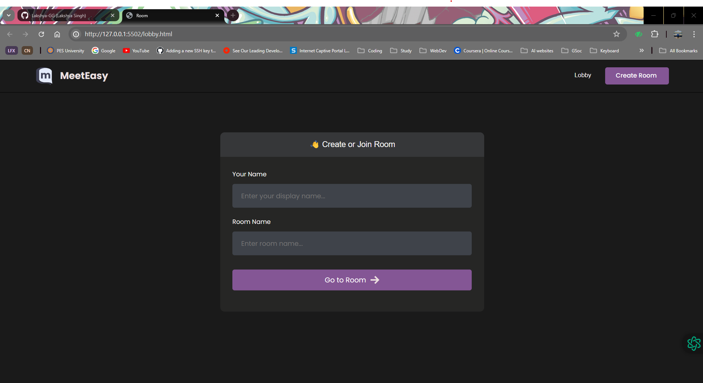
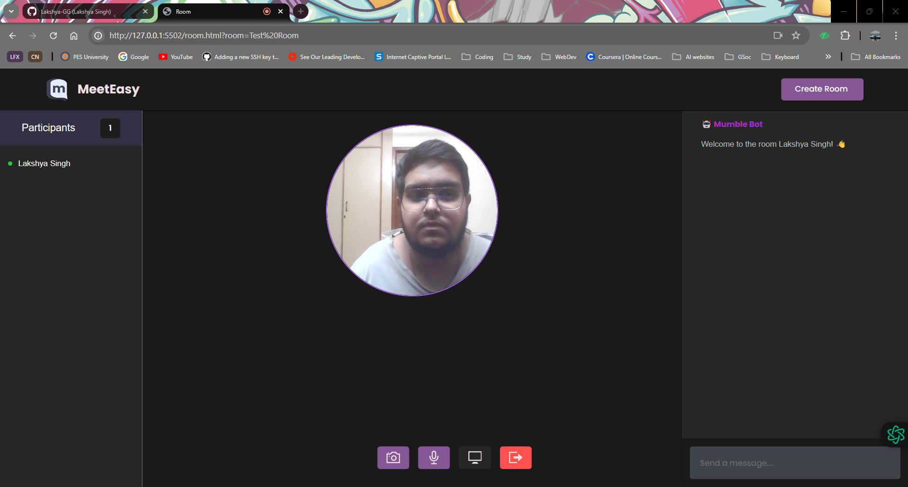
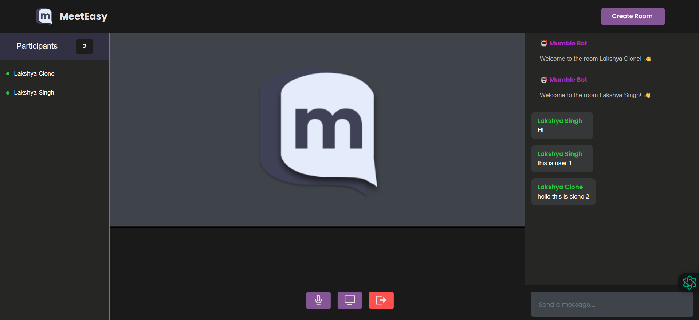
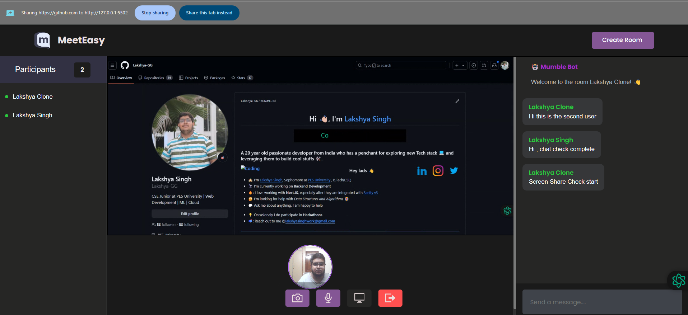
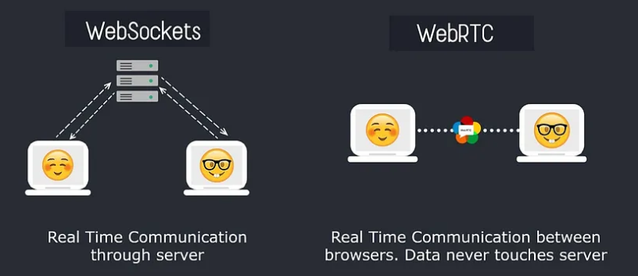
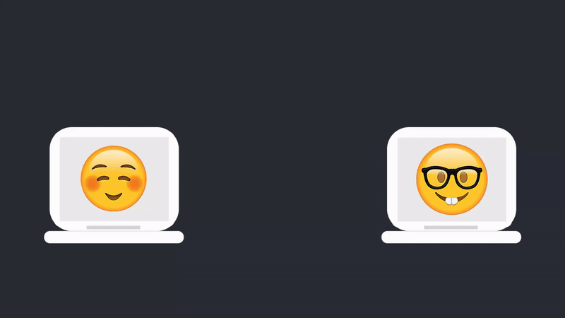
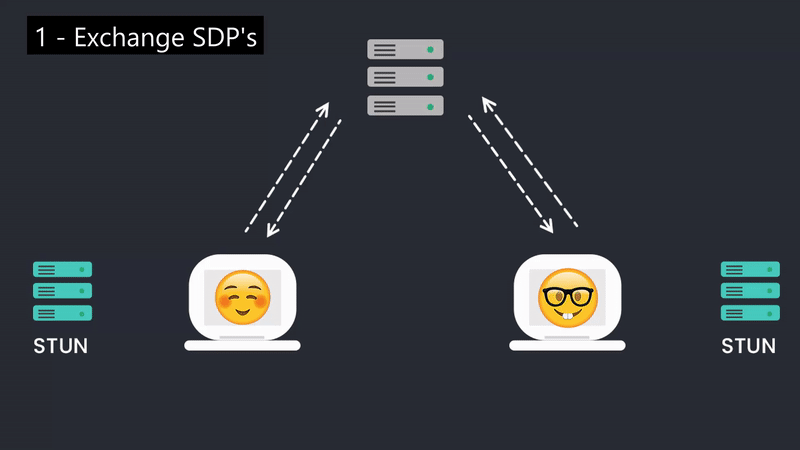

# MeetEasy
A seamless video conferencing platform. Incorporating features such as stream joining, publishing, and user management.and user-friendly controls for mic, camera, and stream quality.

# Demo

<br>

## Room Lobby
  
<br />

## Joined Room
  
<br />

## Messages Cross Client
  
<br />

## Screen Sharing
  
<br />

<hr>

## Tech Stack

1. JavaScript 
2. WebRTC
3. Socket.IO
4. Agora RTM
   
## Installation
1. Clone the repo:
    ```sh
    https://github.com/Lakshya-GG/MeetEasy.git
    ```
2. Create an account on agora.io and create an app to generate an APP ID.
3. Update APP ID and Temp Token.

  


# About WebRTC

WebRTC is a set of JavaScript API’s that allow us to establish a peer to peer connection between two browsers to exchange data such as audio and video, allowing us to create applications with audio and video calling features.

What makes WebRTC special is that once a connection is established; data can be transmitted directly between browsers in real time without touching the server. By bypassing the server we reduce latency since the data doesn’t have to go to the server first, this makes webRTC great for exchanging audio and video.


###  WebRTC Vs WebSockets

Before we talk about how all this works, let’s look at the comparison between WebRTC and WebSockets since I know a lot of you are thinking “this sounds a lot like WebSockets, so why do we need WebRTC?” or vice versa.

  

<br>
With websockets we can also establish a connection between peers to exchange data in real time, but this connection is between the client and server. So if I send a message to a peer, the message first goes to the server, then the server sends that message to the other peer. This exchange typically happens really fast so even though there is some latency, you probably wouldn’t even notice it if you’re sending something like a chat message or some kind of notification.

Now let’s say we wanted to exchange some audio or video using websockets, after all this is possible.

The problem here is that even the slightest latency when it comes to audio and video can be very noticeable and causes a lot of issues. So by the time your video data hits the server and back to your peer, you’re gonna see a significant delay.

This is where webRTC makes sense. By establishing a connection and exchanging data between two browsers we eliminate any delay that the server may add. WebRTC also uses User Datagram Protocol, or UDP, which is great for transmitting data really fast but more on that in a moment.

### So if webRTC is so fast, why use websockets at all?

There are certain limitations with webRTC so typically using webRTC with websockets is more of a common practice.

First, webRTC uses UDP, and UDP is not a reliable protocol for transferring important data. UDP is good at sending data really fast but it doesn’t check whether or not the data is being received. So UDP is great for video because the data gets there fast and if we lose a few frames it’s not a big deal; but if this were a file we needed to send over and we lose a few bytes of data the entire file can be corrupted.

WebRTC also has no built-in signaling so it cant be used on its own to establish a peer to peer connection. WebRTC takes care of everything for us once the connection is established but leaves it up to us on how to transmit the initial data in order to connect two peers.

**So how does all of this work?**

  

<br>

From a high level perspective, to establish a connection, peer 1 will send some kind of message to peer 2 saying “hey, I want to connect to you, here’s some information about me and how you can connect to me, do you accept my offer?”

How this message is sent is irrelevant. This could be an email, a tweet OR you can signal it over to peer 2, it doesn’t matter, that parts up to you.

When peer 2 gets this information from peer 1, they have the opportunity to accept the connection. If peer 2 accepts, they will gather some information about their network and how to connect to it, and then send this information back to peer 1.

Once both peers have eachothers information, they are now connected and can now begin exchanging audio and video data or whatever else they want to send directly between their browsers without needing the server anymore.

So what exactly is sent between the two clients and how is it sent?

First off, how the information is sent is usually through a process called signaling. Since the two peers don’t know about each other we would typically have a way to bring them into a channel together using something like WebSockets or any third party signaling services.

Once we bring them into the same channel or room, they can now signal over their connection details. Those connection details come in the form of a session description protocol (SDP) and ICE candidates.

**SDP** — A Session Description Protocol (SDP), is an object containing information about the session connection such as the codec, address, media type, audio and video and so on. Both peers will exchange SDP’s so they can understand how to connect to each other. One in the form of an SDP Offer and another as an SDP Answer.

**Ice Candidates** — An ICE candidate is a public IP address and port that could potentially be an address that receives data. Each user will typically have multiple Ice candidates that are gathered by making a series of requests to a STUN server.

Exchanging Session Description Protocols and ICE candidates

  

### So here is the order in which things will play out.

First the two peers will exchange SDP’s using some sort of signaling method. Once the two SDP’s are exchanged the peers are now connected, but still CANNOT transmit data yet.

In order to exchange data between two peers we still need to transmit the data.The problem here is that nowadays most devices sit behind firewalls and NAT devices, so to coordinate the discovery of our public IP addresses we use a method called ICE, which stands for Interactive Connectivity Establishment.

So in the background once SDP offers are exchanged each peer will then make a series of requests to a STUN server which will generate a list of ICE candidates to use. STUN servers are cheap and easy to maintain and because of that there are tons of free services you can use so you won’t have to worry about setting one up.

Once peer 1 gets these ICE candidates back from the STUN they will send them over to peer 2 and will let the network determine the best candidate to use. Peer 2 will do the same by requesting their ICE candidates and then sending them to peer 1.

When these candidates are exchanged and an optimal path is discovered data can begin to flow between the two peers


### Trickling ICE Candidates

There’s one problem with the process of retrieving ice candidates and that is that it can take time. So for this we commonly use a method called “Trickle ICE” which means that as we receive each ICE candidate from the STUN server we will simply send them over one by one, so they will “trickle in”.

## Folder Heirarchy
```
📦MeetEasy
 ┣ 📂.git
 ┃ ┣ 📂hooks
 ┃ ┃ ┣ 📜applypatch-msg.sample
 ┃ ┃ ┣ 📜commit-msg.sample
 ┃ ┃ ┣ 📜fsmonitor-watchman.sample
 ┃ ┃ ┣ 📜post-update.sample
 ┃ ┃ ┣ 📜pre-applypatch.sample
 ┃ ┃ ┣ 📜pre-commit.sample
 ┃ ┃ ┣ 📜pre-merge-commit.sample
 ┃ ┃ ┣ 📜pre-push.sample
 ┃ ┃ ┣ 📜pre-rebase.sample
 ┃ ┃ ┣ 📜pre-receive.sample
 ┃ ┃ ┣ 📜prepare-commit-msg.sample
 ┃ ┃ ┣ 📜push-to-checkout.sample
 ┃ ┃ ┗ 📜update.sample
 ┃ ┣ 📂info
 ┃ ┃ ┗ 📜exclude
 ┃ ┣ 📂logs
 ┃ ┃ ┣ 📂refs
 ┃ ┃ ┃ ┣ 📂heads
 ┃ ┃ ┃ ┃ ┗ 📜master
 ┃ ┃ ┃ ┗ 📂remotes
 ┃ ┃ ┃ ┃ ┗ 📂origin
 ┃ ┃ ┃ ┃ ┃ ┗ 📜HEAD
 ┃ ┃ ┗ 📜HEAD
 ┃ ┣ 📂objects
 ┃ ┃ ┣ 📂info
 ┃ ┃ ┗ 📂pack
 ┃ ┃ ┃ ┣ 📜pack-32b23c64d1771d5d4422715beda19e7d04780d0f.idx
 ┃ ┃ ┃ ┗ 📜pack-32b23c64d1771d5d4422715beda19e7d04780d0f.pack
 ┃ ┣ 📂refs
 ┃ ┃ ┣ 📂heads
 ┃ ┃ ┃ ┗ 📜master
 ┃ ┃ ┣ 📂remotes
 ┃ ┃ ┃ ┗ 📂origin
 ┃ ┃ ┃ ┃ ┗ 📜HEAD
 ┃ ┃ ┗ 📂tags
 ┃ ┣ 📜config
 ┃ ┣ 📜description
 ┃ ┣ 📜HEAD
 ┃ ┣ 📜index
 ┃ ┗ 📜packed-refs
 ┣ 📂.vscode
 ┃ ┗ 📜settings.json
 ┣ 📂images
 ┃ ┣ 📂icons
 ┃ ┃ ┗ 📜arrow-right.svg
 ┃ ┣ 📜1.png
 ┃ ┣ 📜2.PNG
 ┃ ┣ 📜3.PNG
 ┃ ┣ 📜4.PNG
 ┃ ┣ 📜hero.svg
 ┃ ┣ 📜logo.png
 ┃ ┣ 📜preview.png
 ┃ ┣ 📜joinedRoom.png
 ┃ ┣ 📜lobby.png
 ┃ ┣ 📜message.png
 ┃ ┣ 📜screenShare.png
 ┃ ┗ 📜stream-thumbnail.png
 ┣ 📂js
 ┃ ┣ 📜agora-rtm-sdk-1.4.4.js
 ┃ ┣ 📜AgoraRTC_N-4.19.3.js
 ┃ ┣ 📜lobby.js
 ┃ ┣ 📜room.js
 ┃ ┣ 📜room_rtc.js
 ┃ ┗ 📜room_rtm.js
 ┣ 📂Starter Template
 ┃ ┣ 📂.vscode
 ┃ ┃ ┗ 📜settings.json
 ┃ ┣ 📂images
 ┃ ┃ ┣ 📂icons
 ┃ ┃ ┃ ┗ 📜arrow-right.svg
 ┃ ┃ ┣ 📜1.png
 ┃ ┃ ┣ 📜2.PNG
 ┃ ┃ ┣ 📜3.PNG
 ┃ ┃ ┣ 📜4.PNG
 ┃ ┃ ┣ 📜hero.svg
 ┃ ┃ ┣ 📜logo.png
 ┃ ┃ ┣ 📜stream-1.png
 ┃ ┃ ┣ 📜stream-2.png
 ┃ ┃ ┣ 📜stream-3.png
 ┃ ┃ ┗ 📜stream-thumbnail.png
 ┃ ┣ 📂js
 ┃ ┃ ┣ 📜lobby.js
 ┃ ┃ ┗ 📜room.js
 ┃ ┣ 📂styles
 ┃ ┃ ┣ 📜lobby.css
 ┃ ┃ ┣ 📜main.css
 ┃ ┃ ┗ 📜room.css
 ┃ ┣ 📜lobby.html
 ┃ ┗ 📜room.html
 ┣ 📂styles
 ┃ ┣ 📜lobby.css
 ┃ ┣ 📜main.css
 ┃ ┗ 📜room.css
 ┣ 📜folderHeirarchy.txt
 ┣ 📜lobby.html
 ┣ 📜README.md
 ┣ 📜room.html
```


# License

This project is open-sourced under the  GPL-3.0  License. See the LICENSE file for more details.